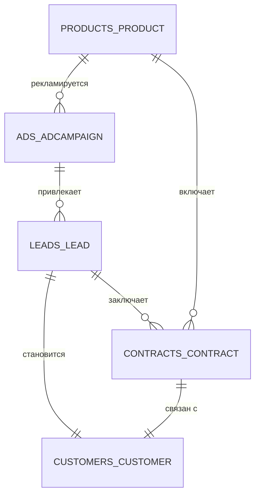

# CRM-system
🏢 CRM-система для управления клиентами

[](https://github.com/Lenar24/CRM-system/actions/workflows/ci.yml)
[](https://www.python.org/)
[](https://www.djangoproject.com/)
[](https://www.postgresql.org/)
[](https://www.docker.com/)
[](https://nginx.org/)
[](https://pylint.org/)
[]()

CRM-система для автоматизации работы с клиентами: управление услугами, 
рекламными кампаниями, лидами, контрактами и активными клиентами. 
Проект разработан на Django с использованием PostgreSQL, Docker и Nginx.
---

## 📋 Оглавление

1. [📝 Описание проекта](#-описание-проекта)
2. [🔄 Бизнес процессы с примерами](#-бизнес-процессы-с-примерами)
3. [👥 Функционал по ролям](#-функционал-по-ролям)
4. [🛠 Технологии](#-технологии)
5. [🗄️ Схема базы данных](#-схема-базы-данных)
6. [📦 Установка и запуск](#-установка-и-запуск)
7. [📁 Структура проекта](#-структура-проекта)
8. [🗺 Маршруты и страницы](#-маршруты-и-страницы)
9. [👑 Роли и права доступа](#-роли-и-права-доступа)
10. [🛠 Как назначить роль пользователю](#-как-назначить-роль-пользователю)
11. [🛠 Как создать группы и назначить права](#-как-создать-группы-и-назначить-права)
12. [💼 Работа с приложением](#-работа-с-приложением)
13. [🧪 Тестирование](#-тестирование)
14. [🔧 Проверка кода](#-проверка-кода)
15. [🤖 CI/CD Pipeline (GitHub Actions)](#-cicd-pipeline-github-actions)
16. [🐳 Docker-команды](#-docker-команды)
17. [❓ Часто задаваемые вопросы](#-часто-задаваемые-вопросы)
18. [🚀 Деплой на сервер](#-деплой-на-сервер)
19. [📄 Лицензия](#-лицензия)
20. [✍️ Автор](#-автор)
21. [🙏 Благодарности](#-благодарности)
---

## 📝 Описание проекта

CRM-система предназначена для:
- **Ведения учёта** предлагаемых компанией услуг
- **Запуска и отслеживания** рекламных кампаний
- **Учёта потенциальных клиентов** (лидов), заинтересовавшихся рекламой
- **Заключения контрактов** с клиентами
- **Перевода лидов** в статус «активные клиенты»
- **Подсчёта статистики** успешности рекламных кампаний

### ⚡ Ключевые возможности

#### 📦 Управление услугами:
- Создание, редактирование, просмотр и удаление услуг
- Каждая услуга содержит: название, описание, стоимость

#### 📢 Управление рекламными кампаниями:
- Создание кампаний с привязкой к услуге
- Выбор канала продвижения (более 20 вариантов)
- Установка бюджета и отслеживание активности
- **Подсчёт статистики** по каждой кампании

#### 👤 Управление лидами (потенциальными клиентами):
- Внесение данных о клиенте (ФИО, телефон, email)
- Привязка к рекламной кампании
- **Перевод в активные клиенты** при заключении контракта

#### 📄 Управление контрактами:
- Создание и хранение контрактов
- Привязка к услуге и клиенту
- Загрузка файлов документов
- Отслеживание дат и сумм

#### 📊 Статистика рекламных кампаний:
- Количество привлечённых лидов
- Количество переходов в активные клиенты
- **ROI** (соотношение дохода от контрактов к расходам на рекламу)

Система позволяет эффективно управлять процессом работы с клиентами, 
отслеживать результативность рекламных кампаний и повышать общую 
продуктивность бизнеса.
---

## 🔄 Бизнес-процессы с примерами

### 🔍 Для кого этот проект

| Роль             | Потребность                               |
|------------------|-------------------------------------------|
| **Маркетолог**   | Запускать рекламу, видеть её окупаемость  |
| **Оператор**     | Быстро вносить заявки от клиентов         |
| **Менеджер**     | Заключать контракты и вести клиентов      |
| **Руководитель** | Видеть полную картину продаж и статистику |

Ниже описан полный цикл работы с CRM-системой на примере компании **«ВебСтрой»**.

```
Создание услуги
       ↓
Создание рекламной кампании (привязка к услуге)
       ↓
Появление лида (потенциального клиента) из рекламной кампании
       ↓
Заключение контракта с лидом
       ↓
Перевод лида в активного клиента
       ↓
Подсчёт статистики по кампании
```

### 1️⃣ Создание услуги
**Кто:** Маркетолог | **Где:** `/products/new/`  
**Пример:** Компания запускает новую услугу — **«Разработка интернет-магазина»**.
- **Название:** Разработка интернет-магазина
- **Описание:** Создание интернет-магазина под ключ с интеграцией платежных систем
- **Стоимость:** 150 000 ₽

### 2️⃣ Создание рекламной кампании
**Кто:** Маркетолог | **Где:** `/ads/new/`  
**Пример:** Для продвижения услуги запускается кампания в Яндекс.Директ.
- **Название:** Яндекс.Директ — Интернет-магазины
- **Рекламируемая услуга:** Разработка интернет-магазина
- **Бюджет:** 30 000 ₽

### 3️⃣ Появление лида (потенциального клиента)
**Кто:** Оператор | **Где:** `/leads/new/`  
**Пример:** Пользователь **Алексей Смирнов** увидел рекламу и оставил заявку.
- **Имя:** Алексей
- **Фамилия:** Смирнов
- **Телефон:** +7 999 123-45-67
- **Email:** alexey@example.com

### 4️⃣ Заключение контракта с лидом
**Кто:** Менеджер | **Где:** `/contracts/new/`  
**Пример:** После переговоров подписан контракт.
- **Название:** Контракт №001/2026
- **Сумма:** 150 000 ₽

### 5️⃣ Перевод лида в активного клиента
**Кто:** Менеджер | **Где:** `/leads/` → кнопка «Перевести в активного»  
**Результат:** Клиент появляется в списке активных `/customers/`.

### 6️⃣ Подсчёт статистики по кампании
**Кто:** Любой авторизованный пользователь | **Где:** `/ads/statistic/`  
**Результат:** ROI кампании составляет **1300%** (420 000 ₽ дохода при бюджете 30 000 ₽).

---
## 👥 Функционал по ролям

| Роль                  | Возможности                                             |
|-----------------------|---------------------------------------------------------|
| **👑 Администратор**  | Управление пользователями и ролями через Django Admin   |
| **📞 Оператор**       | CRUD для лидов                                          |
| **📢 Маркетолог**     | CRUD для услуг и рекламных кампаний                     |
| **💼 Менеджер**       | CRUD для контрактов, просмотр лидов, перевод в активные |
| **👤 Все роли**       | Просмотр статистики рекламных кампаний                  |
---

## 🛠 Технологии

| Компонент               | Технология                       |
|-------------------------|----------------------------------|
| **Бэкенд**              | Django 6.0.7                     |
| **База данных**         | PostgreSQL 17                    |
| **Контейнеризация**     | Docker + Docker Compose          |
| **Веб-сервер**          | Nginx (раздача статики и прокси) |
| **Валидация телефонов** | django-phonenumber-field         |
| **Автоудаление файлов** | django-cleanup                   |
| **Форматирование**      | Black, isort                     |
| **Линтер**              | Pylint (10.00/10)                |
| **Проверка типов**      | Mypy                             |
| **Тестирование**        | Django TestCase (64 теста)       |
---

## 🗄️ Схема базы данных

### Таблицы приложений

| Таблица              | Приложение  | Описание              |
|----------------------|-------------|-----------------------|
| `products_product`   | `products`  | Услуги компании       |
| `ads_adcampaign`     | `ads`       | Рекламные кампании    |
| `leads_lead`         | `leads`     | Потенциальные клиенты |
| `contracts_contract` | `contracts` | Контракты             |
| `customers_customer` | `customers` | Активные клиенты      |

### Связи между таблицами


### 📝 Описание таблиц
*products_product* — **Услуги**

Хранит информацию о предоставляемых компанией услугах.

| Поле	         | Тип	           | Описание                     |
|---------------|----------------|------------------------------|
| id	           | bigint	        | Первичный ключ               |
| name	         | varchar(200)	  | Название услуги (уникальное) |
| description	  | text	          | Описание услуги              |
| price	        | decimal(10,2)	 | Стоимость услуги             |
| created_at	   | datetime	      | Дата создания записи         |
| updated_at	   | datetime	      | Дата обновления записи       |

Индексы: name, price, created_at

---

*ads_adcampaign* — **Рекламные кампании**

Хранит информацию о рекламных кампаниях.

| Поле	       | Тип	           | Описание                        |
|-------------|----------------|---------------------------------|
| id	         | bigint	        | Первичный ключ                  |
| name	       | varchar(200)	  | Название кампании (уникальное)  |
| product_id	 | bigint	        | Внешний ключ к products_product |
| channel	    | varchar(30)	   | Канал продвижения               |
| budget	     | decimal(10,2)	 | Бюджет на рекламу               |
| is_active	  | boolean	       | Активна ли кампания             |
| created_at	 | datetime	      | Дата создания записи            |
| updated_at	 | datetime	      | Дата обновления записи          |

Индексы: name, product_id, created_at, is_active

---

*leads_lead* — **Потенциальные клиенты (Лиды)**

Хранит информацию о потенциальных клиентах.

| Поле	         | Тип	              | Описание                                    |
|---------------|-------------------|---------------------------------------------|
| id	           | bigint	           | Первичный ключ                              |
| first_name	   | varchar(100)	     | Имя                                         |
| last_name	    | varchar(100)	     | Фамилия                                     |
| phone	        | PhoneNumberField	 | Телефон (валидация через phonenumber_field) |
| email	        | EmailField	       | Email (валидация через EmailValidator)      |
| campaign_id	  | bigint	           | Внешний ключ к ads_adcampaign               |
| is_converted	 | boolean	          | Переведён ли в активного клиента            |
| created_at	   | datetime	         | Дата создания записи                        |
| updated_at	   | datetime	         | Дата обновления записи                      |

Индексы: first_name, last_name, phone, email, campaign_id, is_converted

---

*contracts_contract* — **Контракты**

Хранит информацию о заключённых контрактах.

| Поле	            | Тип	           | Описание                        |
|------------------|----------------|---------------------------------|
| id	              | bigint	        | Первичный ключ                  |
| name	            | varchar(200)	  | Название контракта (уникальное) |
| product_id	      | bigint	        | Внешний ключ к products_product |
| lead_id	         | bigint	        | Внешний ключ к leads_lead       |
| document	        | varchar(100)	  | Путь к файлу документа          |
| signing_date	    | date	          | Дата заключения контракта       |
| validity_period	 | varchar(100)	  | Период действия                 |
| amount	          | decimal(12,2)	 | Сумма контракта                 |
| created_at	      | datetime	      | Дата создания записи            |
| updated_at	      | datetime	      | Дата обновления записи          |
Индексы: name, product_id, lead_id, signing_date, amount

---

*customers_customer* — **Активные клиенты**

Хранит информацию о клиентах, переведённых из лидов в клиенты.

| Поле	        | Тип	      | Описание                                   |
|--------------|-----------|--------------------------------------------|
| id	          | bigint	   | Первичный ключ                             |
| lead_id	     | bigint	   | Внешний ключ к leads_lead (1-to-1)         |
| contract_id	 | bigint	   | Внешний ключ к contracts_contract (1-to-1) |
| is_active	   | boolean	  | Активен ли клиент                          |
| created_at	  | datetime	 | Дата создания записи                       |
| updated_at	  | datetime	 | Дата обновления записи                     |

Индексы: lead_id, contract_id, is_active, created_at

---

## 📦 Установка и запуск

**Требования**

* Docker
* Docker Compose

1. Клонирование репозитория
```
git clone https://github.com/your-username/CRM-system.git
cd CRM-system
```

2. Переменные окружения

Создайте файл .env в корне проекта:
```
env
# Django settings
SECRET_KEY=django-insecure-ваш-секретный-ключ
DEBUG=True
ALLOWED_HOSTS=localhost,127.0.0.1

# Database settings
DB_NAME=crm_system_db
DB_USER=postgresql
DB_PASSWORD=postgresql
DB_HOST=db
DB_PORT=5432
```
>⚠️ Важно: Для продакшена замените SECRET_KEY и пароли на свои, а DEBUG 
установите в False.

3. Запуск через Docker
```
# Собрать и запустить контейнеры
docker compose up -d --build

# Применить миграции
docker compose exec web python manage.py migrate

# Собрать статические файлы (для Nginx)
docker compose exec web python manage.py collectstatic --noinput

# Создать суперпользователя (администратора)
docker compose exec web python manage.py createsuperuser
```
4. Доступ к приложению

| Страница	                | URL                                        |
|--------------------------|--------------------------------------------|
| Главная страница	        | http://localhost:80                        |
| Вход в систему	          | http://localhost:80/accounts/login/        |
| Административная панель	 | http://localhost:80/admin/                 |
| Прямой доступ к Django	  | http://localhost:8000 (только для отладки) |

Какой порт использовать?

| URL                        | Для кого             | Описание                                                                      |
|----------------------------|----------------------|-------------------------------------------------------------------------------|
| **http://localhost/**      | 👤 **Пользователи**  | Основной адрес через Nginx (порт 80). Используйте его для работы с системой.  |
| **http://localhost:8000/** | 🛠️ **Разработчики** | Прямой доступ к Django (только для отладки). Не используйте в обычной работе. |

5. Архитектура с Nginx
```
Пользователь
    ↓
Nginx (порт 80)
    ├── /static/ → отдаёт статику напрямую
    ├── /media/  → отдаёт медиа напрямую
    └── /        → прокси на Django (порт 8000)
                    ↓
                Django (WSGI/ASGI)
                    ↓
                PostgreSQL
```
---

## 📁 Структура проекта

```
CRM-system/
├── CRM_system/ # Настройки проекта
│ ├── settings.py # Основные настройки
│ ├── urls.py # Главные URL-адреса
│ └── views.py # Представления (главная страница)
├── products/ # Приложение «Услуги»
├── ads/ # Приложение «Рекламные кампании»
├── leads/ # Приложение «Потенциальные клиенты»
├── contracts/ # Приложение «Контракты»
├── customers/ # Приложение «Активные клиенты»
├── analytics/ # Приложение «Статистика»
├── users/ # Приложение «Главная страница»
├── registration/ # Приложение «Авторизация»
├── templates/ # HTML-шаблоны
│ ├── _base.html # Базовый шаблон
│ ├── products/ # Шаблоны услуг
│ ├── ads/ # Шаблоны кампаний
│ ├── leads/ # Шаблоны лидов
│ ├── contracts/ # Шаблоны контрактов
│ ├── customers/ # Шаблоны клиентов
│ └── registration/ # Шаблоны авторизации
├── static/ # Исходная статика (CSS)
├── staticfiles/ # Собранная статика для Nginx
├── media/ # Загруженные файлы (контракты)
├── docker-compose.yml # Оркестрация контейнеров
├── Dockerfile # Сборка образа Django
├── nginx.conf # Конфигурация Nginx
├── requirements.txt # Зависимости Python
├── pyproject.toml # Настройки (Black, isort, Pylint, Coverage)
├── mypy.ini # Настройки Mypy
└── README.md # Документация
```
---

## 🗺 Маршруты и страницы

**Основные страницы:**

| URL	               | Страница	               | Роль               |
|--------------------|-------------------------|--------------------|
| /	                 | Главная со статистикой	 | Все авторизованные |
| /accounts/login/	  | Вход в систему	         | Все                |
| /accounts/logout/	 | Выход	                  | Все авторизованные |

**Услуги (/products/):**

| URL	                    | Действие	              | Роль       |
|-------------------------|------------------------|------------|
| /products/	             | Список услуг	          | Все        |
| /products/<id>/	        | Детальная страница	    | Все        |
| /products/new/	         | Создание услуги	       | Маркетолог |
| /products/<id>/edit/	   | Редактирование услуги	 | Маркетолог |
| /products/<id>/delete/	 | Удаление услуги	       | Маркетолог |

**Рекламные кампании (/ads/):**

| URL	               | Действие	                | Роль       |
|--------------------|--------------------------|------------|
| /ads/	             | Список кампаний	         | Все        |
| /ads/<id>/	        | Детальная страница	      | Все        |
| /ads/new/	         | Создание кампании	       | Маркетолог |
| /ads/<id>/edit/	   | Редактирование кампании	 | Маркетолог |
| /ads/<id>/delete/	 | Удаление кампании	       | Маркетолог |
| /ads/statistic/	   | Статистика кампаний	     | Все        |

**Потенциальные клиенты (/leads/):**

| URL	                  | Действие	            | Роль               |
|-----------------------|----------------------|--------------------|
| /leads/	              | Список лидов	        | Оператор, Менеджер |
| /leads/<id>/	         | Детальная страница	  | Оператор, Менеджер |
| /leads/new/	          | Создание лида	       | Оператор           |
| /leads/<id>/edit/	    | Редактирование лида	 | Оператор           |
| /leads/<id>/delete/	  | Удаление лида	       | Оператор           |
| /leads/<id>/convert/	 | Перевод в активного	 | Менеджер           |

**Контракты (/contracts/):**

| URL	                     | Действие	                 | Роль     |
|--------------------------|---------------------------|----------|
| /contracts/	             | Список контрактов	        | Менеджер |
| /contracts/<id>/	        | Детальная страница	       | Менеджер |
| /contracts/new/	         | Создание контракта	       | Менеджер |
| /contracts/<id>/edit/	   | Редактирование контракта	 | Менеджер |
| /contracts/<id>/delete/	 | Удаление контракта	       | Менеджер |

**Активные клиенты (/customers/):**

| URL	                     | Действие	               | Роль     |
|--------------------------|-------------------------|----------|
| /customers/	             | Список клиентов	        | Менеджер |
| /customers/<id>/	        | Детальная страница	     | Менеджер |
| /customers/new/	         | Создание клиента	       | Менеджер |
| /customers/<id>/edit/	   | Редактирование клиента	 | Менеджер |
| /customers/<id>/delete/	 | Удаление клиента	       | Менеджер |
---

## 👑 Роли и права доступа

**В системе используются следующие роли:**

| Роль	          | Описание	                         | Права                                                   |
|----------------|-----------------------------------|---------------------------------------------------------|
| Администратор	 | Полный доступ к системе	          | Управление пользователями через Django Admin            |
| Оператор	      | Работа с лидами	                  | Создание, просмотр, редактирование, удаление лидов      |
| Маркетолог	    | Работа с услугами и рекламой	     | CRUD для услуг и рекламных кампаний                     |
| Менеджер	      | Работа с контрактами и клиентами	 | CRUD для контрактов, просмотр лидов, перевод в активные |
---

## 🛠 Как назначить роль пользователю

1. Войдите в административную панель
```
http://localhost:80/admin/
```
2. Войдите под суперпользователем
```
Логин и пароль, которые вы создали командой *createsuperuser*.
```
3. Создание нового пользователя:
```
1. Перейдите в раздел "Users"
2. Нажмите "Add user"
3. Заполните поля:
- Username — логин
- Password — пароль
- First name / Last name — имя и фамилия
- Email — email
4. Нажмите "Save and continue editing"
```
4. Назначение роли
```
В карточке пользователя найдите раздел "Permissions"

В разделе "User permissions" выберите нужные права:

Для оператора:

✅ leads | lead | Can add lead
✅ leads | lead | Can change lead
✅ leads | lead | Can delete lead
✅ leads | lead | Can view lead

Для маркетолога:

✅ products | product | Can add product
✅ products | product | Can change product
✅ products | product | Can delete product
✅ products | product | Can view product
✅ ads | ad campaign | Can add ad campaign
✅ ads | ad campaign | Can change ad campaign
✅ ads | ad campaign | Can delete ad campaign
✅ ads | ad campaign | Can view ad campaign

Для менеджера:

✅ contracts | contract | Can add contract
✅ contracts | contract | Can change contract
✅ contracts | contract | Can delete contract
✅ contracts | contract | Can view contract
✅ leads | lead | Can view lead
✅ leads | lead | Can convert lead

Нажмите "Save"
```
5. Проверка
```
Пользователь может войти в систему и будет видеть только те разделы, 
для которых у него есть права.
```
---

## 🛠 Как создать группы и назначить права

1. Войдите в админку:
```
http://localhost/admin/
```
2. Создайте группы:
```
1. Перейдите в раздел Auth → Groups
2. Нажмите "Add group"
3. Назовите группу, например:

✅ Операторы
✅ Маркетологи
✅ Менеджеры
✅ Администраторы

4. Назначьте разрешения группам:

Группа «Операторы»:

✅ leads | lead | Can view lead
✅ leads | lead | Can add lead
✅ leads | lead | Can change lead
✅ leads | lead | Can delete lead

Группа «Маркетологи»:

✅ products | product | Can view product
✅ products | product | Can add product
✅ products | product | Can change product
✅ products | product | Can delete product
✅ ads | ad campaign | Can view ad campaign
✅ ads | ad campaign | Can add ad campaign
✅ ads | ad campaign | Can change ad campaign
✅ ads | ad campaign | Can delete ad campaign

Группа «Менеджеры»:

✅ contracts | contract | Can view contract
✅ contracts | contract | Can add contract
✅ contracts | contract | Can change contract
✅ contracts | contract | Can delete contract
✅ leads | lead | Can view lead
✅ leads | lead | Can convert lead
```
3. Добавьте пользователей в группы:
```
- Перейдите в раздел Auth → Users
- Выберите пользователя
- В разделе Groups выберите нужную группу
- Нажмите "Save"
```
---

## 💼 Работа с приложением

После того как роли назначены и пользователи созданы, можно начинать 
работать с CRM-системой. Ниже описан полный цикл работы — от создания услуги до просмотра статистики.


### 🔄 Полный рабочий цикл
```
Создание услуги
↓
Запуск рекламной кампании
↓
Добавление лида (потенциального клиента)
↓
Заключение контракта
↓
Перевод лида в активного клиента
↓
Просмотр статистики
```

### 1️⃣ Создание услуги

**Кто делает:** Маркетолог  
**Где:** `/products/new/`

**Данные для заполнения:**

| Поле      | Пример                                                             |
|-----------|--------------------------------------------------------------------|
| Название  | Разработка интернет-магазина                                       |
| Описание  | Создание интернет-магазина под ключ с интеграцией платежных систем |
| Стоимость | 150 000 ₽                                                          |

**Результат:** Услуга появляется в списке `/products/` и доступна для 
привязки к рекламным кампаниям.

### 2️⃣ Запуск рекламной кампании

**Кто делает:** Маркетолог  
**Где:** `/ads/new/`

**Данные для заполнения:**

| Поле                 | Пример                            |
|----------------------|-----------------------------------|
| Название кампании    | Яндекс.Директ — Интернет-магазины |
| Рекламируемая услуга | Разработка интернет-магазина      |
| Канал продвижения    | Контекстная реклама               |
| Бюджет               | 30 000 ₽                          |

**Результат:** Кампания запущена и начинает привлекать лидов.

### 3️⃣ Добавление лида (потенциального клиента)

**Кто делает:** Оператор  
**Где:** `/leads/new/`

**Данные для заполнения:**

| Поле               | Пример                            |
|--------------------|-----------------------------------|
| Имя                | Алексей                           |
| Фамилия            | Смирнов                           |
| Телефон            | +7 999 123-45-67                  |
| Email              | alexey@example.com                |
| Рекламная кампания | Яндекс.Директ — Интернет-магазины |

**Результат:** Лид появляется в списке `/leads/`. 
Теперь с ним может работать менеджер.

### 4️⃣ Заключение контракта

**Кто делает:** Менеджер  
**Где:** `/contracts/new/`

**Данные для заполнения:**

| Поле              | Пример                       |
|-------------------|------------------------------|
| Название          | Контракт №001/2026           |
| Услуга            | Разработка интернет-магазина |
| Клиент            | Алексей Смирнов              |
| Файл с документом | `contract_001_2026.pdf`      |
| Дата заключения   | 15.07.2026                   |
| Период действия   | 12 месяцев                   |
| Сумма             | 150 000 ₽                    |

**Результат:** Контракт создан и привязан к лиду.

### 5️⃣ Перевод лида в активного клиента

**Кто делает:** Менеджер  
**Где:** `/leads/` → нажать **«Перевести в активного»**

**Данные для заполнения:**

| Поле                 |   | Пример                          |
|----------------------|:--|---------------------------------|
| Потенциальный клиент |   | Алексей Смирнов (предзаполнено) |
| Контракт             |   | Контракт №001/2026              |

**Результат:**
- ✅ Лид перестаёт отображаться в списке `/leads/`
- ✅ Клиент появляется в списке активных `/customers/`
- ✅ Статистика по кампании обновляется

### 6️⃣ Просмотр статистики

**Кто делает:** Любой авторизованный пользователь  
**Где:** `/ads/statistic/`

**Что видно:**

| Показатель            | Пример                            |
|-----------------------|-----------------------------------|
| Название кампании     | Яндекс.Директ — Интернет-магазины |
| Бюджет                | 30 000 ₽                          |
| Привлечено лидов      | 12                                |
| Перешло в активные    | 3                                 |
| Доход от контрактов   | 420 000 ₽                         |
| **ROI (окупаемость)** | **1300%**                         |

**Результат:** Маркетолог видит, что кампания окупилась в 14 раз, 
и может принять решение об увеличении бюджета.

### 🧭 Навигация по приложению

| Раздел             | URL               | Кто может          |
|--------------------|-------------------|--------------------|
| Главная страница   | `/`               | Все авторизованные |
| Услуги             | `/products/`      | Все авторизованные |
| Рекламные кампании | `/ads/`           | Все авторизованные |
| Статистика         | `/ads/statistic/` | Все авторизованные |
| Лиды               | `/leads/`         | Оператор, Менеджер |
| Контракты          | `/contracts/`     | Менеджер           |
| Активные клиенты   | `/customers/`     | Менеджер           |
| Админка            | `/admin/`         | Администратор      |

> 💡 **Совет:** Если какой-то раздел недоступен — проверьте, что ваш пользователь авторизован и имеет нужные права (роль). Все изменения сохраняются мгновенно и отображаются в статистике.

---

## 🧪 Тестирование

**Запуск всех тестов**
```
docker compose exec web python manage.py test -v 2 --keepdb
```
**Запуск тестов для конкретного приложения**
```
docker compose exec web python manage.py test products
docker compose exec web python manage.py test ads
docker compose exec web python manage.py test leads
docker compose exec web python manage.py test contracts
docker compose exec web python manage.py test customers
docker compose exec web python manage.py test analytics
docker compose exec web python manage.py test registration
docker compose exec web python manage.py test users
```
**Результаты**
```
✅ 64 теста пройдены
✅ Покрытие кода > 80%
```
**Покрытие кода**
```
# Запустить тесты с coverage
docker compose exec web coverage run manage.py test --keepdb

# Посмотреть отчёт
docker compose exec web coverage report -m

# Создать HTML-отчёт
docker compose exec web coverage html

Открыть htmlcov/index.html в браузере
```
---

## 🔧 Проверка кода

**Форматирование**
```
# Сортировка импортов (isort)
docker compose exec web isort ads/ analytics/ contracts/ customers/ leads/ products/ registration/ users/ CRM_system/

# Форматирование кода (Black)
docker compose exec web black ads/ analytics/ contracts/ customers/ leads/ products/ registration/ users/ CRM_system/
```
**Проверка качества**
```
# Pylint (оценка качества кода)
docker compose exec web pylint ads/ analytics/ contracts/ customers/ leads/ products/ registration/ users/ CRM_system/ --load-plugins=pylint_django --django-settings-module=CRM_system.settings --score=y

# Mypy (проверка типов)
docker compose exec web python -m mypy --config-file=mypy.ini ads/ analytics/ contracts/ customers/ leads/ products/ registration/ users/ CRM_system/
```
**Результаты проверок**
```
✅ Pylint: 10.00/10
✅ Mypy: Success: no issues
✅ isort: Все импорты отсортированы
✅ Black: Код отформатирован
```
---

## 🤖 CI/CD Pipeline (GitHub Actions)

Проект использует **GitHub Actions** для автоматической проверки качества 
кода при каждом пуше в ветки `develop` и `main`.

### Что проверяется автоматически:

| Шаг | Инструмент   | Что делает                                |
|-----|--------------|-------------------------------------------|
| 1   | **isort**    | Проверяет сортировку импортов             |
| 2   | **Black**    | Проверяет форматирование кода             |
| 3   | **Pylint**   | Проверяет качество кода (оценка 10.00/10) |
| 4   | **Mypy**     | Проверяет типы данных                     |
| 5   | **Тесты**    | Запускает все 64 теста                    |
| 6   | **Coverage** | Собирает отчёт о покрытии кода            |

### Как посмотреть результат:

1. Перейдите в раздел **Actions** вашего репозитория на GitHub
2. Выберите последний запуск workflow
3. Просмотрите логи каждого шага

### Статус пайплайна:

Текущий статус отображается в бейдже в шапке README:

[](https://github.com/Lenar24/CRM-system/actions/workflows/ci.yml)

✅ **Зелёный** — все проверки пройдены  
❌ **Красный** — есть ошибки, требуется исправление
---

## 🐳 Docker-команды

**Управление контейнерами:**
```
# Запустить контейнеры в фоне
docker compose up -d

# Запустить с пересборкой образов
docker compose up -d --build

# Остановить контейнеры
docker compose down

# Остановить и удалить тома (потеря данных БД)
docker compose down -v

# Перезапустить Django
docker compose restart web

# Перезапустить Nginx
docker compose restart nginx

# Посмотреть статус контейнеров
docker compose ps

# Посмотреть логи Django
docker compose logs -f web

# Посмотреть логи Nginx
docker compose logs -f nginx

# Посмотреть логи PostgreSQL
docker compose logs -f db
```
**Выполнение команд:**
```
# Войти в контейнер Django
docker compose exec web bash

# Выполнить миграции
docker compose exec web python manage.py migrate

# Собрать статику для Nginx
docker compose exec web python manage.py collectstatic --noinput

# Создать суперпользователя
docker compose exec web python manage.py createsuperuser

# Запустить Django shell
docker compose exec web python manage.py shell

# Проверить состояние миграций
docker compose exec web python manage.py showmigrations

# Проверить конфиг Nginx
docker compose exec nginx nginx -t
```
---

## ❓ Часто задаваемые вопросы
1. Как создать суперпользователя?
```
docker compose exec web python manage.py createsuperuser
```
2. Как назначить пользователю роль?
```
Через административную панель /admin/, раздел Users → 
выбрать пользователя → User permissions.
```
3. Как перевести лида в активного клиента?
```
1. Перейдите в /leads/
2. Нажмите "Перевести в активного" у нужного лида
3. Заполните форму создания активного клиента (выберите контракт)
4. Нажмите "Сохранить"
```
4. Как посмотреть статистику по кампаниям?
```
Перейдите в /ads/statistic/ или нажмите "Статистика" на странице списка кампаний.
```
5. Как очистить базу данных и начать заново?
```
docker compose down -v
docker compose up -d --build
docker compose exec web python manage.py migrate
docker compose exec web python manage.py createsuperuser
```
6. Почему после входа я вижу ошибку 404?
```
Проверьте, что у вашего пользователя есть права доступа к странице. 
Обратитесь к администратору.
```
7. Как добавить новые каналы продвижения?
```
В файле ads/models.py в CHANNEL_CHOICES добавьте новый кортеж 
("код", "Название").
```
8. Как изменить настройки кеширования?
```
В settings.py в секции CACHES измените TIMEOUT (в секундах).
```
9. Как работает Nginx?
```
Nginx:
- Отдаёт статику (/static/) и медиа (/media/) напрямую
- Проксирует все остальные запросы на Django (порт 8000)
- Ускоряет загрузку страниц за счёт кеширования статики
```
10. Как проверить, что Nginx работает?
```
curl -I http://localhost/static/style.css
# Должен быть заголовок: Server: nginx/...
```
---

## 🚀 Деплой на сервер

1. Настроить переменные окружения для продакшена

```
# Создать .env.production
SECRET_KEY=новый_секретный_ключ
DEBUG=False
ALLOWED_HOSTS=ваш-домен.com
DB_NAME=crm_system_db
DB_USER=postgresql
DB_PASSWORD=новый_пароль
DB_HOST=db
DB_PORT=5432
```
2. Настроить SSL (через Let's Encrypt)
```
# Установить Certbot
apt install certbot python3-certbot-nginx

# Получить сертификат
certbot --nginx -d ваш-домен.com
```
3. Запустить в продакшене
```
docker compose -f docker-compose.prod.yml up -d
```
---

## 📄 Лицензия

Проект создан в учебных целях.

---

## ✍️ Автор
Ленар Зиннуров — zinnurov.lenar@gmail.com, Zinnurov.lenar.1981@yandex.ru

---

## 🙏 Благодарности

**Skillbox** за предоставленное техническое задание

**Django** за отличный фреймворк

**PostgreSQL** за надёжную базу данных

**Docker** за удобную контейнеризацию

**Nginx** за быструю раздачу статики
